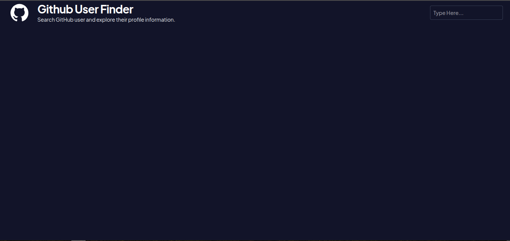
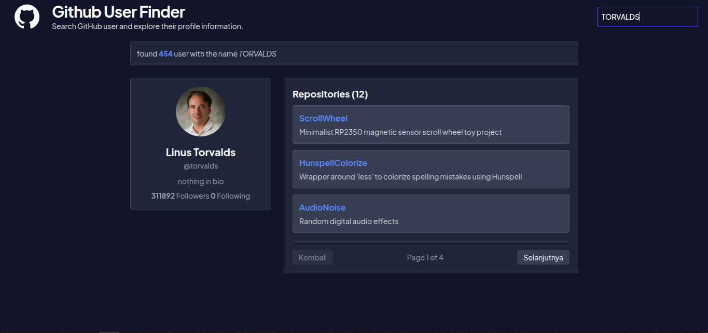
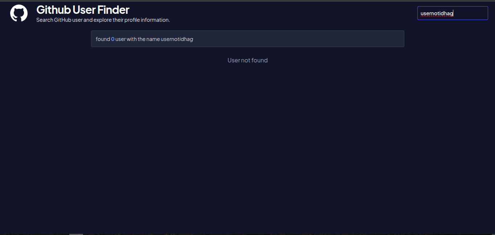
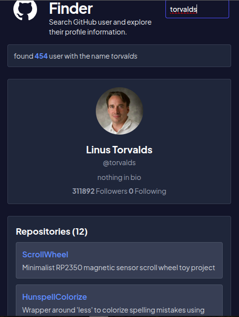

# GitHub User Finder


GitHub User Finder adalah aplikasi web sederhana yang memungkinkan pengguna mencari profil GitHub berdasarkan username. Aplikasi ini menampilkan informasi profil pengguna, jumlah followers/following, serta daftar repository terbarunya. Project ini dibangun menggunakan React dengan hooks seperti useState, useEffect, dan useRef, lalu mengambil data dari GitHub API melalui native fetch, dan menggunakan Tailwind CSS untuk styling.

## Deskripsi Project

Aplikasi ini bertujuan untuk memberikan pengalaman pencarian pengguna GitHub yang cepat dan intuitif. Setelah pengguna memasukkan nama pengguna, aplikasi akan melakukan request ke API GitHub, lalu menampilkan hasil pencarian dalam bentuk kartu profil dan daftar repository.

## Live Demo

🌐 https://github-user-finder-harisss132.netlify.app

## Preview

Berikut beberapa screenshot hasil tampilan aplikasi:









## Fitur Utama

- Mencari pengguna GitHub berdasarkan username
- Menampilkan hasil pencarian dengan debounce agar request tidak terlalu sering dipanggil
- Menampilkan profil pengguna lengkap seperti avatar, nama, bio, followers, dan following
- Menampilkan daftar repository pengguna
- Mendukung pagination repository sederhana
- Menampilkan state loading dan hasil kosong secara informatif
- UI modern dan responsif dengan Tailwind CSS

## Tech Stack

Frontend

- React
- Vite
- Tailwind CSS

API

- GitHub REST API

Deployment

- Netlify

Version Control

- Git & GitHub

## Struktur Project

```bash
src/
├── App.jsx
├── main.jsx
├── index.css
├── components/
│   ├── RepositoryCard.jsx
│   ├── SearchBar.jsx
│   └── UserCard.jsx
├── layout/
│   └── Navbar.jsx
```

## Penjelasan Komponen

### 1. App.jsx
Komponen utama aplikasi yang mengatur:
- state pencarian
- debounce search
- proses fetch data ke GitHub API
- menampilkan hasil profil dan repository

### 2. SearchBar.jsx
Komponen input pencarian yang menerima nilai input dari pengguna dan mengirimkannya ke parent component.

### 3. UserCard.jsx
Komponen untuk menampilkan informasi utama pengguna, seperti:
- avatar
- nama
- username
- bio
- followers dan following

### 4. RepositoryCard.jsx
Komponen untuk menampilkan repository pengguna dengan fitur pagination sederhana.

### 5. Navbar.jsx
Komponen header aplikasi yang menampilkan branding atau tampilan navigasi atas.

## Cara Kerja Aplikasi

1. Pengguna mengetik username di kolom pencarian.
2. Aplikasi menggunakan debounce dengan delay sekitar 600ms agar pencarian tidak langsung memanggil API setiap kali input berubah.
3. Setelah delay selesai, useEffect akan memicu request ke GitHub API.
4. Data hasil pencarian diproses dan ditampilkan dalam bentuk:
   - profil pengguna
   - jumlah repository
   - daftar repository
5. Jika data tidak ditemukan, aplikasi akan menampilkan status yang sesuai.

## API yang Digunakan

Project ini menggunakan GitHub REST API, terutama endpoint berikut:

- Search users:
  - https://api.github.com/search/users?q={query}
- Get user profile:
  - https://api.github.com/users/{username}
- Get repositories:
  - https://api.github.com/users/{username}/repos?sort=created&per_page=3&page={page}

## Instalasi dan Menjalankan Project

### Prerequisites

Pastikan Anda sudah menginstall:
- Node.js (versi 18 atau lebih disarankan)
- npm

### Langkah-langkah

1. Clone repository:

```bash
git clone https://github.com/Harisss132/github-user-finder.git
cd github-user-finder
```

2. Install dependency:

```bash
npm install
```

3. Jalankan aplikasi:

```bash
npm run dev
```

4. Buka browser dan akses:

```bash
http://localhost:5173
```

## Build untuk Production

Untuk membangun versi production, jalankan:

```bash
npm run build
```

## Keunggulan Project

- Ringan dan mudah dipahami
- Menggunakan pendekatan modern React dengan hooks
- Tidak bergantung pada library tambahan untuk fetch data karena menggunakan native fetch
- Styling cepat dan fleksibel dengan Tailwind CSS

## Apa yang Saya Pelajari dari Project Ini

- Cara membangun aplikasi React dengan struktur komponen yang terorganisir
- Penggunaan React Hooks seperti useState, useEffect, dan useRef untuk mengelola state dan efek samping
- Cara mengambil data dari API GitHub menggunakan fetch dan menangani loading serta error state
- Penerapan debounce untuk mengurangi request API yang berlebihan saat pengguna mengetik
- Teknik membuat UI responsif dan menarik dengan Tailwind CSS
- Pentingnya memecah tampilan menjadi komponen kecil agar kode lebih mudah dipelihara dan dikembangkan
- Cara mengintegrasikan desain dan fungsionalitas menjadi aplikasi yang lebih nyata dan berguna
- Menggunakan Promise.all() untuk menjalankan beberapa request API secara bersamaan
- Menggunakan AbortController untuk membatalkan request yang sudah tidak diperlukan

## Challenges

Selama proses deployment saya mengalami masalah karena GitHub Personal Access Token terdeteksi oleh GitHub Secret Scanning sehingga token otomatis di-revoke.

Dari pengalaman tersebut saya mempelajari bahwa secret atau access token tidak boleh digunakan langsung pada frontend karena seluruh kode frontend akan dikirim ke browser pengguna.

Untuk implementasi production, token sebaiknya disimpan di backend menggunakan environment variable (process.env) agar tetap aman.

## Kelemahan / Catatan

- Aplikasi ini bergantung pada API GitHub yang memiliki batas rate limit
- Jika token tidak tersedia, jumlah request yang bisa dilakukan mungkin lebih terbatas
- Untuk kebutuhan produksi, disarankan menambahkan handling error yang lebih detail dan optimasi UX lebih lanjut

## Rencana Pengembangan Selanjutnya

- Menambahkan fitur pencarian repository secara langsung
- Menampilkan lebih banyak repository per halaman
- Menambahkan dark/light mode
- Menambahkan fitur bookmark pengguna favorit
- Menambahkan testing menggunakan Vitest atau React Testing Library

## Kesimpulan

Project ini dibuat sebagai bagian dari proses pembelajaran React Fundamental dengan fokus pada React Hooks, API Integration, Debouncing, Component Architecture, dan Responsive UI menggunakan Tailwind CSS.

Selain menyelesaikan implementasi fitur utama, project ini juga memberikan pengalaman dalam proses deployment menggunakan Netlify serta debugging permasalahan yang muncul pada lingkungan production.
